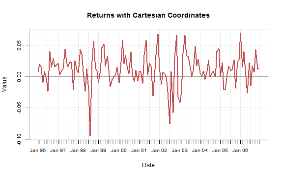
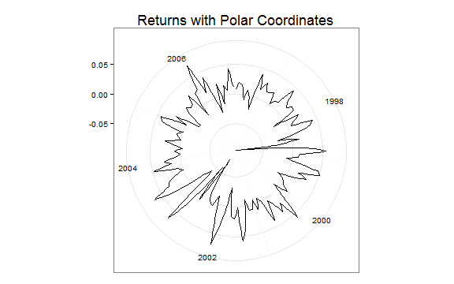

<style>
iframe {height: 420px; width: 620px}
</style>

## Micropolar Extended Line Plot Example


### Cartesian System

Typically with finance time series, we plot with a Cartesian system like this.


```r
require(rCharts)
require(PerformanceAnalytics)
#use the built in managers dataset from PerformanceAnalytics
data(managers)
chart.TimeSeries(
  managers[,1],
  main = "Returns with Cartesian Coordinates"
)
```

 


If we were to use `rCharts` with `d3js`, Cartesian still generally prevails as demonstrated by this simple `dimplejs` plot of the same returns from above.


```r
managers.df <- data.frame(
  index(managers),
  managers[,1]
)
colnames(managers.df) <- c( "date", "HAM1" )
managers.df$date <- format(managers.df$date, "%Y-%m-%d")
dP <- dPlot(
  HAM1 ~ date,
  data = managers.df,
  type = "line",
  height = 400,
  width = 600
)
dP$xAxis(
  type = "addTimeAxis",
  inputFormat = "%Y-%m-%d",
  outputFormat = "%b %Y"
)
dP$yAxis(
  outputFormat = '.2%'
)
dP
```

<iframe src=assets/fig/dimple-plot.html seamless></iframe>

<br/>

### Polar System

However, we do have another option in Polar Coordinates.  `ggplot2` offers easy access to Polar Coordiantes with [`coord_polar`](http://docs.ggplot2.org/current/coord_polar.html).  Here is a simple example.


```r
require(ggplot2)
autoplot(managers[,1]) + coord_polar() +
  theme_bw() + theme( plot.title =  element_text(size = rel(1.5))) +
  labs( title = "Returns with Polar Coordinates" ) + xlab( NULL ) + ylab (NULL)
```

 


Until yesterday, getting an interactive `d3js` version required an inordinate amount of work.  Now we have [`micropolar`](http://micropolar.org) from Chris Viau that was quickly made accessible by `rCharts` author Ramnath Vaidyanathan and detailed [here](http://rcharts.io/howitworks/micropolar).


```r
retData <- data.frame(
  # 0 to nrow scaled to 360 since 360 deg in circle
  0:(NROW(managers)-1) * 360/NROW(managers),
  # make numeric javascript date
  as.numeric(as.POSIXct(index(managers[,1])))*1000, 
  managers[,1]
)
colnames(retData) <- c('x','date','y')
retLine <- rCharts$new()
retLine$setLib(
  'http://rcharts.github.io/howitworks/libraries/widgets/micropolar'
)
retLine$set(
  data = make_dataset( x = "x", y= "y", data = retData),
  type = "linePlot",
  originTheta = 0,
  radialAxisTheta = 0,
  angularDomain = 
    paste0(
      "#!d3.time.format('%b %Y')(new Date(",
      retData$date[seq(1,NROW(retData),6)],
      "))!#"),
  #radialDomain = c( 0, 1),
  angularTicksSuffix = '',
  tickOrientation = "horizontal",
  minorTicks = 0,
  flip = TRUE,
  height = 400,
  width = 400
)
retLine
```

<iframe src=assets/fig/unnamed-chunk-4.html seamless></iframe>


Polar coordinates do have good and interesting use cases, but they are not always good as evidenced by the often maligned pie chart.  Whether good or bad, I will leave to the reader.  It is nice though to have the option.

Thanks Ramnath Vaidyanathan and Chris Viau.
